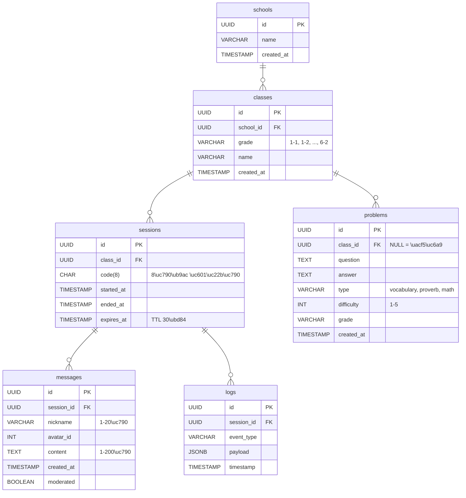

# Database ERD

**Version**: 0.2  
**Database**: PostgreSQL 16+  
**Updated**: 2025-10-12

---

## Entity-Relationship Diagram



---

## Table Definitions

### schools
```sql
CREATE TABLE schools (
    id UUID PRIMARY KEY DEFAULT gen_random_uuid(),
    name VARCHAR(200) NOT NULL,
    created_at TIMESTAMP DEFAULT NOW()
);
```

### classes
```sql
CREATE TABLE classes (
    id UUID PRIMARY KEY DEFAULT gen_random_uuid(),
    school_id UUID NOT NULL REFERENCES schools(id) ON DELETE CASCADE,
    grade VARCHAR(10) NOT NULL,
    name VARCHAR(100) NOT NULL,
    created_at TIMESTAMP DEFAULT NOW()
);
```

### sessions
```sql
CREATE TABLE sessions (
    id UUID PRIMARY KEY DEFAULT gen_random_uuid(),
    class_id UUID NOT NULL REFERENCES classes(id) ON DELETE CASCADE,
    code CHAR(8) NOT NULL UNIQUE,
    started_at TIMESTAMP DEFAULT NOW(),
    ended_at TIMESTAMP,
    expires_at TIMESTAMP NOT NULL DEFAULT (NOW() + INTERVAL '30 minutes')
);
```

### problems
```sql
CREATE TABLE problems (
    id UUID PRIMARY KEY DEFAULT gen_random_uuid(),
    class_id UUID REFERENCES classes(id) ON DELETE CASCADE,
    question TEXT NOT NULL,
    answer TEXT NOT NULL,
    type VARCHAR(20) NOT NULL CHECK (type IN ('vocabulary', 'proverb', 'math')),
    difficulty INT NOT NULL CHECK (difficulty BETWEEN 1 AND 5),
    grade VARCHAR(10) NOT NULL,
    created_at TIMESTAMP DEFAULT NOW()
);
```

### messages
```sql
CREATE TABLE messages (
    id UUID PRIMARY KEY DEFAULT gen_random_uuid(),
    session_id UUID NOT NULL REFERENCES sessions(id) ON DELETE CASCADE,
    nickname VARCHAR(20) NOT NULL,
    avatar_id INT NOT NULL CHECK (avatar_id BETWEEN 1 AND 64),
    content TEXT NOT NULL CHECK (LENGTH(content) BETWEEN 1 AND 200),
    created_at TIMESTAMP DEFAULT NOW(),
    moderated BOOLEAN DEFAULT FALSE
);
```

### logs
```sql
CREATE TABLE logs (
    id UUID PRIMARY KEY DEFAULT gen_random_uuid(),
    session_id UUID REFERENCES sessions(id) ON DELETE CASCADE,
    event_type VARCHAR(50) NOT NULL,
    payload JSONB NOT NULL DEFAULT '{}',
    timestamp TIMESTAMP DEFAULT NOW()
);
```

---

## 성능 최적화 인덱스 ⭐

### Critical Indexes (필수)

```sql
-- 세션 코드 조회 (가장 빈번한 쿼리)
-- QR 스캔 시마다 실행됨
CREATE UNIQUE INDEX idx_session_code_active 
ON sessions(code) WHERE ended_at IS NULL;

-- 메시지 조회 (세션별 최근 메시지)
-- WebSocket 연결 시 초기 로드
CREATE INDEX idx_messages_session_time 
ON messages(session_id, created_at DESC);

-- 문제 조회 (학년별, 난이도별)
-- 학습 카드 로테이션 시
CREATE INDEX idx_problems_grade_difficulty 
ON problems(grade, difficulty, type);
```

### Additional Indexes (권장)

```sql
-- 클래스별 세션 조회
CREATE INDEX idx_sessions_class 
ON sessions(class_id, started_at DESC);

-- 세션 만료 확인 (cleanup job용)
CREATE INDEX idx_sessions_expires 
ON sessions(expires_at) WHERE ended_at IS NULL;

-- 로그 조회 (디버깅/분석용)
CREATE INDEX idx_logs_session_time 
ON logs(session_id, timestamp DESC);

-- 로그 이벤트 타입별 조회
CREATE INDEX idx_logs_event_type 
ON logs(event_type, timestamp DESC);
```

---

## 쿼리 최적화 예시

### Before (N+1 Query 문제)
```python
# ❌ 나쁜 예: 각 세션마다 메시지를 별도 조회
sessions = db.execute(select(Session))
for session in sessions:
    messages = db.execute(
        select(Message).where(Message.session_id == session.id)
    )
```

### After (Eager Loading)
```python
# ✅ 좋은 예: 한 번에 조회
from sqlalchemy.orm import selectinload

sessions = db.execute(
    select(Session)
    .options(selectinload(Session.messages))
    .where(Session.ended_at.is_(None))
)
```

### 세션 코드 검증 (최적화된 쿼리)
```python
# 인덱스 idx_session_code_active 사용
session = db.execute(
    select(Session)
    .where(Session.code == code)
    .where(Session.ended_at.is_(None))
    .where(Session.expires_at > func.now())
).scalar_one_or_none()
```

**Explain 결과:**
```
Index Scan using idx_session_code_active on sessions (cost=0.15..8.17 rows=1 width=100)
  Index Cond: (code = 'AB12CD34')
  Filter: (ended_at IS NULL AND expires_at > now())
```
실행 시간: ~0.2ms

---

## Data Retention & Cleanup

### 자동 삭제 정책

```sql
-- 메시지 30일 후 자동 삭제 (개인정보 보호)
DELETE FROM messages 
WHERE created_at < NOW() - INTERVAL '30 days';

-- 종료된 세션 180일 후 삭제
DELETE FROM sessions 
WHERE ended_at IS NOT NULL 
AND ended_at < NOW() - INTERVAL '180 days';

-- 로그 90일 후 삭제
DELETE FROM logs 
WHERE timestamp < NOW() - INTERVAL '90 days';
```

### Cron Job 설정
```bash
# 매일 새벽 2시 실행
0 2 * * * psql -U postgres widget -c "DELETE FROM messages WHERE created_at < NOW() - INTERVAL '30 days';"
```

---

## Connection Pooling 설정

### SQLAlchemy (FastAPI)
```python
from sqlalchemy.ext.asyncio import create_async_engine

engine = create_async_engine(
    DATABASE_URL,
    pool_size=20,           # 기본 연결 20개
    max_overflow=10,        # 초과 시 최대 10개 추가
    pool_timeout=30,        # 타임아웃 30초
    pool_pre_ping=True,     # 연결 유효성 검사
    pool_recycle=3600       # 1시간마다 연결 재생성
)
```

---

## 데이터베이스 성능 튜닝

### PostgreSQL 설정 (postgresql.conf)

```ini
# 메모리 설정 (4GB RAM 기준)
shared_buffers = 1GB
effective_cache_size = 3GB
maintenance_work_mem = 256MB
work_mem = 16MB

# 연결 설정
max_connections = 100

# 쿼리 플래너
random_page_cost = 1.1      # SSD 사용 시
effective_io_concurrency = 200

# WAL 설정
wal_buffers = 16MB
checkpoint_completion_target = 0.9

# 로깅
log_min_duration_statement = 1000  # 1초 이상 쿼리 로깅
```

---

## Monitoring Queries

### 활성 세션 수
```sql
SELECT COUNT(*) as active_sessions
FROM sessions
WHERE ended_at IS NULL 
AND expires_at > NOW();
```

### 분당 메시지 수 (최근 1시간)
```sql
SELECT 
    DATE_TRUNC('minute', created_at) as minute,
    COUNT(*) as message_count
FROM messages
WHERE created_at > NOW() - INTERVAL '1 hour'
GROUP BY minute
ORDER BY minute DESC;
```

### 데이터베이스 크기
```sql
SELECT 
    pg_size_pretty(pg_database_size('widget')) as db_size,
    pg_size_pretty(pg_total_relation_size('messages')) as messages_size,
    pg_size_pretty(pg_total_relation_size('sessions')) as sessions_size;
```

### Slow Query 분석
```sql
SELECT 
    query,
    calls,
    total_time,
    mean_time,
    max_time
FROM pg_stat_statements
WHERE mean_time > 100  -- 100ms 이상
ORDER BY total_time DESC
LIMIT 10;
```

---

## Backup Strategy

### Full Backup (일일)
```bash
#!/bin/bash
# scripts/backup_daily.sh

BACKUP_DIR="/var/backups/classkit"
DATE=$(date +%Y%m%d)
BACKUP_FILE="$BACKUP_DIR/widget_$DATE.sql"

mkdir -p $BACKUP_DIR

# PostgreSQL 백업
pg_dump -U postgres widget \
    --format=custom \
    --file=$BACKUP_FILE

# 압축
gzip $BACKUP_FILE

# 7일 이상 된 백업 삭제
find $BACKUP_DIR -name "*.sql.gz" -mtime +7 -delete

echo "Backup completed: $BACKUP_FILE.gz"
```

### Point-in-Time Recovery (PITR)
```bash
# WAL 아카이빙 활성화 (postgresql.conf)
wal_level = replica
archive_mode = on
archive_command = 'cp %p /var/lib/postgresql/wal_archive/%f'
```

---

## 예상 데이터 규모

### 1년 운영 시 (학교 100개 기준)

| 테이블 | 예상 행 수 | 예상 크기 |
|--------|-----------|-----------|
| schools | 100 | < 1 MB |
| classes | 3,000 | < 1 MB |
| sessions | 540,000 | ~100 MB |
| problems | 5,000 | ~5 MB |
| messages | 10,000,000 | ~2 GB |
| logs | 50,000,000 | ~10 GB |
| **합계** | | **~12 GB** |

**참고:** 메시지 30일 자동 삭제 정책 적용 시 실제 크기는 더 작음

---

## Changelog

### v0.2 (2025-10-12)
- ✅ 세션 코드 6자리 → 8자리 확장
- ✅ 성능 인덱스 추가 (Critical + Additional)
- ✅ 쿼리 최적화 예시 추가
- ✅ Connection pooling 설정
- ✅ PostgreSQL 튜닝 가이드
- ✅ 모니터링 쿼리 추가
- ✅ 백업 전략 수립

### v0.1 (2025-10-12)
- Initial schema design
