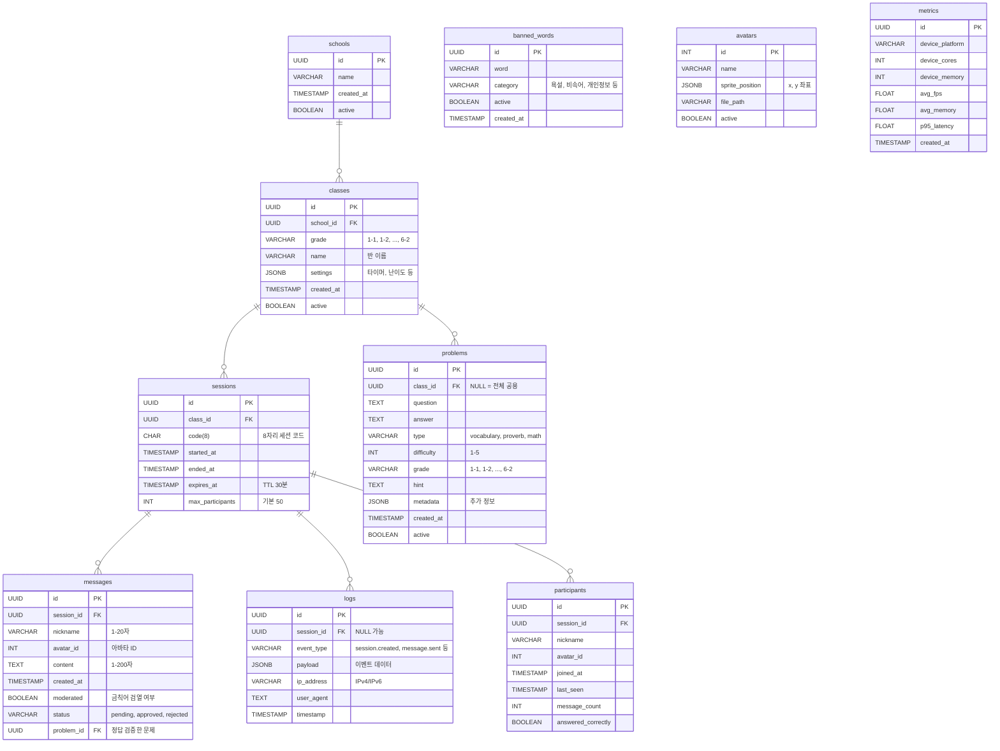

# Database ERD

**Version**: 0.2  
**Database**: PostgreSQL 16+  
**Updated**: 2025-10-12

---

## Entity-Relationship Diagram



---

## Table Details

### schools
학교 정보

| Column | Type | Constraints | Description |
|--------|------|-------------|-------------|
| id | UUID | PK | 학교 ID |
| name | VARCHAR(200) | NOT NULL | 학교명 |
| created_at | TIMESTAMP | DEFAULT NOW() | 생성 시각 |
| active | BOOLEAN | DEFAULT TRUE | 활성 여부 |

**Indexes:**
```sql
CREATE INDEX idx_schools_active ON schools(active);
```

---

### classes
반 정보

| Column | Type | Constraints | Description |
|--------|------|-------------|-------------|
| id | UUID | PK | 반 ID |
| school_id | UUID | FK → schools.id | 학교 ID |
| grade | VARCHAR(10) | NOT NULL | 학년-반 (예: "5-1") |
| name | VARCHAR(100) | NOT NULL | 반 이름 |
| settings | JSONB | DEFAULT '{}' | 설정 (타이머, 난이도 등) |
| created_at | TIMESTAMP | DEFAULT NOW() | 생성 시각 |
| active | BOOLEAN | DEFAULT TRUE | 활성 여부 |

**Indexes:**
```sql
CREATE INDEX idx_classes_school ON classes(school_id);
CREATE INDEX idx_classes_active ON classes(active);
```

**Settings JSONB Example:**
```json
{
  "default_timer": 45,
  "default_difficulty": 3,
  "auto_moderate": false
}
```

---

### sessions
세션 (수업 단위)

| Column | Type | Constraints | Description |
|--------|------|-------------|-------------|
| id | UUID | PK | 세션 ID |
| class_id | UUID | FK → classes.id | 반 ID |
| code | CHAR(8) | UNIQUE NOT NULL | 8자리 세션 코드 |
| started_at | TIMESTAMP | DEFAULT NOW() | 시작 시각 |
| ended_at | TIMESTAMP | NULL | 종료 시각 |
| expires_at | TIMESTAMP | NOT NULL | 만료 시각 (30분) |
| max_participants | INT | DEFAULT 50 | 최대 참여자 수 |

**Indexes:**
```sql
CREATE UNIQUE INDEX idx_session_code_active 
ON sessions(code) WHERE ended_at IS NULL;

CREATE INDEX idx_sessions_class ON sessions(class_id);
CREATE INDEX idx_sessions_expires ON sessions(expires_at);
```

**Triggers:**
```sql
-- 자동 만료 시각 설정
CREATE OR REPLACE FUNCTION set_session_expires()
RETURNS TRIGGER AS $$
BEGIN
    NEW.expires_at := NEW.started_at + INTERVAL '30 minutes';
    RETURN NEW;
END;
$$ LANGUAGE plpgsql;

CREATE TRIGGER set_session_expires_trigger
BEFORE INSERT ON sessions
FOR EACH ROW
EXECUTE FUNCTION set_session_expires();
```

---

### problems
학습 문제

| Column | Type | Constraints | Description |
|--------|------|-------------|-------------|
| id | UUID | PK | 문제 ID |
| class_id | UUID | FK → classes.id NULL | 반 전용 (NULL = 공용) |
| question | TEXT | NOT NULL | 문제 내용 |
| answer | TEXT | NOT NULL | 정답 |
| type | VARCHAR(20) | NOT NULL | vocabulary, proverb, math |
| difficulty | INT | CHECK 1-5 | 난이도 |
| grade | VARCHAR(10) | NOT NULL | 학년 (예: "5-1") |
| hint | TEXT | NULL | 힌트 |
| metadata | JSONB | DEFAULT '{}' | 추가 정보 |
| created_at | TIMESTAMP | DEFAULT NOW() | 생성 시각 |
| active | BOOLEAN | DEFAULT TRUE | 활성 여부 |

**Indexes:**
```sql
CREATE INDEX idx_problems_type ON problems(type);
CREATE INDEX idx_problems_grade ON problems(grade);
CREATE INDEX idx_problems_difficulty ON problems(difficulty);
CREATE INDEX idx_problems_active ON problems(active);
CREATE INDEX idx_problems_class ON problems(class_id);
```

**Metadata JSONB Example:**
```json
{
  "pronunciation": "/ˈdɪlɪdʒənt/",
  "example": "She is a diligent student.",
  "image_url": "https://cdn.../vocab123.jpg"
}
```

---

### messages
학생 메시지

| Column | Type | Constraints | Description |
|--------|------|-------------|-------------|
| id | UUID | PK | 메시지 ID |
| session_id | UUID | FK → sessions.id | 세션 ID |
| nickname | VARCHAR(20) | NOT NULL | 닉네임 |
| avatar_id | INT | NOT NULL | 아바타 ID |
| content | TEXT | NOT NULL CHECK(LENGTH ≤ 200) | 메시지 내용 |
| created_at | TIMESTAMP | DEFAULT NOW() | 생성 시각 |
| moderated | BOOLEAN | DEFAULT FALSE | 검열 여부 |
| status | VARCHAR(20) | DEFAULT 'approved' | pending/approved/rejected |
| problem_id | UUID | FK → problems.id NULL | 정답 검증한 문제 |

**Indexes:**
```sql
CREATE INDEX idx_messages_session_time 
ON messages(session_id, created_at DESC);

CREATE INDEX idx_messages_status ON messages(status);
```

**Constraints:**
```sql
ALTER TABLE messages ADD CONSTRAINT check_content_length
CHECK (LENGTH(content) >= 1 AND LENGTH(content) <= 200);

ALTER TABLE messages ADD CONSTRAINT check_nickname_length
CHECK (LENGTH(nickname) >= 1 AND LENGTH(nickname) <= 20);
```

**Triggers:**
```sql
-- 자동 금칙어 검사
CREATE OR REPLACE FUNCTION check_banned_words()
RETURNS TRIGGER AS $$
BEGIN
    IF EXISTS (
        SELECT 1 FROM banned_words 
        WHERE NEW.content ILIKE '%' || word || '%' 
        AND active = TRUE
    ) THEN
        NEW.moderated := TRUE;
        NEW.status := 'pending';
    END IF;
    RETURN NEW;
END;
$$ LANGUAGE plpgsql;

CREATE TRIGGER check_banned_words_trigger
BEFORE INSERT ON messages
FOR EACH ROW
EXECUTE FUNCTION check_banned_words();
```

---

### logs
이벤트 로그

| Column | Type | Constraints | Description |
|--------|------|-------------|-------------|
| id | UUID | PK | 로그 ID |
| session_id | UUID | FK → sessions.id NULL | 세션 ID |
| event_type | VARCHAR(50) | NOT NULL | 이벤트 타입 |
| payload | JSONB | NOT NULL | 이벤트 데이터 |
| ip_address | VARCHAR(45) | NULL | IP 주소 |
| user_agent | TEXT | NULL | User-Agent |
| timestamp | TIMESTAMP | DEFAULT NOW() | 발생 시각 |

**Indexes:**
```sql
CREATE INDEX idx_logs_session ON logs(session_id);
CREATE INDEX idx_logs_event_type ON logs(event_type);
CREATE INDEX idx_logs_timestamp ON logs(timestamp DESC);
```

**Partitioning (선택):**
```sql
-- 월별 파티셔닝
CREATE TABLE logs_partitioned (
    LIKE logs INCLUDING ALL
) PARTITION BY RANGE (timestamp);

CREATE TABLE logs_2025_10 PARTITION OF logs_partitioned
FOR VALUES FROM ('2025-10-01') TO ('2025-11-01');
```

**Event Types:**
- `session.created`
- `session.ended`
- `message.sent`
- `message.moderated`
- `problem.answered`
- `user.joined`
- `error.occurred`

---

### participants
세션 참여자

| Column | Type | Constraints | Description |
|--------|------|-------------|-------------|
| id | UUID | PK | 참여자 ID |
| session_id | UUID | FK → sessions.id | 세션 ID |
| nickname | VARCHAR(20) | NOT NULL | 닉네임 |
| avatar_id | INT | NOT NULL | 아바타 ID |
| joined_at | TIMESTAMP | DEFAULT NOW() | 참여 시각 |
| last_seen | TIMESTAMP | DEFAULT NOW() | 마지막 활동 |
| message_count | INT | DEFAULT 0 | 보낸 메시지 수 |
| answered_correctly | BOOLEAN | DEFAULT FALSE | 정답 여부 |

**Indexes:**
```sql
CREATE INDEX idx_participants_session 
ON participants(session_id);

CREATE INDEX idx_participants_last_seen 
ON participants(last_seen DESC);
```

---

### banned_words
금칙어

| Column | Type | Constraints | Description |
|--------|------|-------------|-------------|
| id | UUID | PK | 금칙어 ID |
| word | VARCHAR(50) | UNIQUE NOT NULL | 금칙어 |
| category | VARCHAR(20) | NOT NULL | 욕설, 비속어 등 |
| active | BOOLEAN | DEFAULT TRUE | 활성 여부 |
| created_at | TIMESTAMP | DEFAULT NOW() | 등록 시각 |

**Indexes:**
```sql
CREATE INDEX idx_banned_words_active ON banned_words(active);
```

---

### avatars
아바타 메타데이터

| Column | Type | Constraints | Description |
|--------|------|-------------|-------------|
| id | INT | PK | 아바타 ID (1-64) |
| name | VARCHAR(50) | NOT NULL | 아바타 이름 |
| sprite_position | JSONB | NOT NULL | 스프라이트 시트 좌표 |
| file_path | VARCHAR(255) | NULL | 개별 파일 경로 (옵션) |
| active | BOOLEAN | DEFAULT TRUE | 활성 여부 |

**Sprite Position Example:**
```json
{
  "x": 0,
  "y": 0,
  "width": 16,
  "height": 16
}
```

---

### metrics
성능 메트릭

| Column | Type | Constraints | Description |
|--------|------|-------------|-------------|
| id | UUID | PK | 메트릭 ID |
| device_platform | VARCHAR(20) | NOT NULL | Win32, Linux 등 |
| device_cores | INT | NULL | CPU 코어 수 |
| device_memory | INT | NULL | 메모리 (GB) |
| avg_fps | FLOAT | NULL | 평균 FPS |
| avg_memory | FLOAT | NULL | 평균 메모리 (MB) |
| p95_latency | FLOAT | NULL | P95 레이턴시 (ms) |
| created_at | TIMESTAMP | DEFAULT NOW() | 수집 시각 |

**Indexes:**
```sql
CREATE INDEX idx_metrics_created ON metrics(created_at DESC);
CREATE INDEX idx_metrics_platform ON metrics(device_platform);
```

---

## Relationships

```
schools (1) ─── (N) classes
classes (1) ─── (N) sessions
classes (1) ─── (N) problems
sessions (1) ─── (N) messages
sessions (1) ─── (N) logs
sessions (1) ─── (N) participants
problems (1) ─── (N) messages (검증용)
```

---

## Migration Strategy

### Initial Setup
```sql
-- 1. UUID 확장 활성화
CREATE EXTENSION IF NOT EXISTS "uuid-ossp";

-- 2. 테이블 생성 순서
CREATE TABLE schools (...);
CREATE TABLE classes (...);
CREATE TABLE sessions (...);
CREATE TABLE problems (...);
CREATE TABLE messages (...);
CREATE TABLE logs (...);
CREATE TABLE participants (...);
CREATE TABLE banned_words (...);
CREATE TABLE avatars (...);
CREATE TABLE metrics (...);

-- 3. 인덱스 생성
-- (위 각 테이블 섹션 참조)

-- 4. 초기 데이터
INSERT INTO avatars (id, name, sprite_position) VALUES
(1, '학생1', '{"x": 0, "y": 0}'),
(2, '학생2', '{"x": 16, "y": 0}'),
...
(64, '학생64', '{"x": 112, "y": 112}');
```

---

## Data Retention Policy

| Table | Retention | Action |
|-------|-----------|--------|
| messages | 30 days | Auto-delete |
| logs | 90 days | Archive to cold storage |
| sessions | 180 days | Soft delete (ended_at) |
| metrics | 365 days | Aggregate to daily stats |

**Cleanup Job:**
```sql
-- 매일 자정 실행
DELETE FROM messages 
WHERE created_at < NOW() - INTERVAL '30 days';

DELETE FROM logs 
WHERE timestamp < NOW() - INTERVAL '90 days';
```

---

## Performance Optimization

### Connection Pooling
```python
# SQLAlchemy
engine = create_async_engine(
    DATABASE_URL,
    pool_size=20,
    max_overflow=10,
    pool_pre_ping=True
)
```

### Query Optimization Examples

**Bad (N+1 Query):**
```python
sessions = await db.execute(select(Session))
for session in sessions:
    messages = await db.execute(
        select(Message).where(Message.session_id == session.id)
    )
```

**Good (Eager Loading):**
```python
sessions = await db.execute(
    select(Session).options(selectinload(Session.messages))
)
```

---

## Backup Strategy

**Daily:**
```bash
pg_dump -U postgres widget > backup_$(date +%Y%m%d).sql
```

**Hourly (Incremental):**
```bash
pg_basebackup -D /backup/$(date +%Y%m%d_%H) -Ft -z -P
```

---

## Security Considerations

1. **Row-Level Security (RLS):**
```sql
-- 학생은 자신이 속한 세션의 메시지만 조회
ALTER TABLE messages ENABLE ROW LEVEL SECURITY;

CREATE POLICY student_messages ON messages
FOR SELECT USING (session_id = current_setting('app.session_id')::UUID);
```

2. **Encryption at Rest:**
```bash
# PostgreSQL 14+ TDE (Transparent Data Encryption)
ALTER SYSTEM SET data_encryption = on;
```

3. **Connection Security:**
```bash
# postgresql.conf
ssl = on
ssl_cert_file = '/path/to/server.crt'
ssl_key_file = '/path/to/server.key'
```

---

## Monitoring Queries

**Active Sessions:**
```sql
SELECT code, COUNT(p.id) as participants
FROM sessions s
LEFT JOIN participants p ON s.id = p.session_id
WHERE s.ended_at IS NULL
GROUP BY s.code;
```

**Message Rate (per minute):**
```sql
SELECT 
    DATE_TRUNC('minute', created_at) as minute,
    COUNT(*) as message_count
FROM messages
WHERE created_at > NOW() - INTERVAL '1 hour'
GROUP BY minute
ORDER BY minute DESC;
```

**Database Size:**
```sql
SELECT 
    pg_size_pretty(pg_database_size('widget')) as db_size,
    pg_size_pretty(pg_total_relation_size('messages')) as messages_size;
```

---

## Changelog

### v0.2 (2025-10-12)
- ✅ 세션 코드 6자리 → 8자리 확장
- ✅ `participants` 테이블 추가
- ✅ `banned_words` 테이블 추가
- ✅ `avatars` 테이블 추가
- ✅ `metrics` 테이블 추가
- ✅ `messages.problem_id` 외래키 추가
- ✅ 인덱스 및 트리거 추가

### v0.1 (2025-10-12)
- Initial schema design
