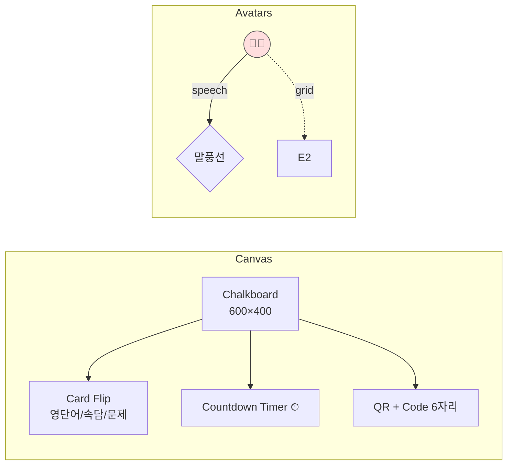

# UI Wireframe Notes

## 1. Classroom Widget (Full Screen)



* **업무모드**: Card & Timer 중앙 확대, Avatars/QR hidden

## 2. Mobile PWA

```
| CodeValid? → Form |
+---------------------------------------+
| 닉네임 [_______]   반 [3-2 ▾]         |
| 문제: read ______ loudly.             |
| 정답 [_______] ▶                     |
| Avatar selector (scroll)             |
| 메시지 [____________________]        |
| [ SEND ]                             |
|  — AdSense NPA Banner —              |
+---------------------------------------+
```

