# UI Wireframe Notes

## 1. Classroom Widget (Full Screen)

```mermaid
graph LR
    subgraph Canvas
        A[Chalkboard<br/>600×400] --> B[Card Flip<br/>영단어/속담/문제]
        A --> C[Countdown Timer ⏱]
        A --> D[QR + Code 6자리]
    end

    subgraph Avatars
        E((🧑‍🎓)):::avatar -->|speech| F{"말풍선"}
        E -. grid .-> E2
    end

classDef avatar fill:#ffdede,stroke:#555,stroke-width:1px;
```



* **업무모드**: Card & Timer 중앙 확대, Avatars/QR hidden

## 2. Mobile PWA

```
| CodeValid? → Form |
+---------------------------------------+
| 닉네임 [_______]   반 [3-2 ▾]         |
| 문제: read ______ loudly.             |
| 정답 [_______] ▶                     |
| Avatar selector (scroll)             |
| 메시지 [____________________]        |
| [ SEND ]                             |
|  — AdSense NPA Banner —              |
+---------------------------------------+
```

